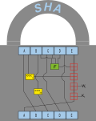
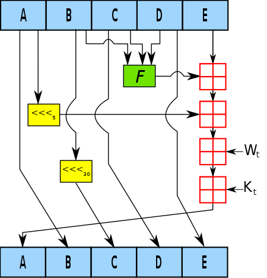

:kr: SHA-1(안전한뭇칼질알고리즘)

---
# SHA-1(안전한뭇칼질알고리즘)  
출처: https://en.wikipedia.org/wiki/SHA-1

----
[암호술(cryptography)](https://en.wikipedia.org/wiki/Cryptography)에서, SHA-1(Secure Hash Algorithm-1, 안전한뭇칼질알고리즘-1)은 입력을 받고 [소식요약(전언, message digest)](https://en.wikipedia.org/wiki/Cryptographic_hash_function)라고 하는 160비트(20바이트) 뭇칼질 값을 생성하는 암호뭇칼질함수이다-일반적으로 16진수로 만든다, 40자리 길이. 이것은 연합정부국가안보대행사(United States National Security Agency)에 의해 설계되었다, 그리고 연합정부 연방정보처리표준(Federal Information Processing Standard)이다.

2005년 이후 SHA-1은 (well-funded) 대상에 대항하여 안전하다고 생각하지 않는다, 그리고 2010년 이후 많은 조직에서 SHA-2 또는 SHA-3으로 대체할 것을 권고한다. 마이크로소프트, 구글, 애플 그리고 모질라 모두 발표했다 각 브라우저는 SHA-1 SSL 인증 수락을 2017년에 중지할 것이라고.

2017년에 [CWI 암스텔담](https://en.wikipedia.org/wiki/Centrum_Wiskunde_%26_Informatica)과 [구글](https://en.wikipedia.org/wiki/Google)은 SHA-1에 대항하는 충돌공격을 수행했다고 발표했다, 같은 SHA-1 뭇칼질을 생성하는 두개의 서로다른 PDF파일을 공표함.

```
충돌은 컴퓨터과학과 전기통신에서 약간 다른 의미로 사용된다.
컴퓨터과학에서는 함수가 두개의 다른 입력이 똑같은 출력으로 보여주는(매핑) 상황을 가리킨다.
전기통신에서는, 망의 두개의 마디가 동시에 전송하기 위하여 시도할 때 충돌이 발생했다고 한다.
```

```
TLS: Transport Layer Security(전송층보안)
SSL: Secure Sockets Layer(안전한꼬지층)
```

> 목차  
  1. 개발  
  2. 응용프로그램  
    2.1 암호술(Cryptography)  
    2.2 자료 무결성(Data integrity)  
  3. 암호해독과 검증(Cryptanalysis and validation)  
    3.1 공격  
      3.1.1 The SHAppening  
      3.1.2 SHAttered – first public collision  
    3.2 SHA-0  
    3.3 공식검증(Official validation)  
  4. 본보기와 모사코드(Examples and pseudocode)  
    4.1 본보기 뭇칼질(Example hashes)  
    4.2 SHA-1 모사코드(SHA-1 pseudocode)  
  5. SHA 함수의 비교하기(Comparison of SHA functions)  
  6. See also  
  7. Notes  
  8. References  
  9. External links  

# 1. 개발
  
  
```
SHA-1 압축함수 내에서 한번 반복:
  A, B, C, D와 E는 상태의 워드인 32-bit이다;
  F는 변화하는 비선형 함수이다;
  <<<n 표시는 n자리에 대한 왼쪽비트회전;
  n은 각 연산에 대한 변화;
  Wt는 t모둠(round)의 확장소식(전언)단어;
  Kt는 t모둠(round)의 모둠(round)상수;
  십자상자 표시는 2의32승 진법(modulo) 덧셈;
```

 SHA-1은 MIT의 [Ronald L. Rivest](https://en.wikipedia.org/wiki/Ron_Rivest)가 [MD4](https://en.wikipedia.org/wiki/MD4)와 [MD5](https://en.wikipedia.org/wiki/MD5) 소식요약(전언, message digest) 알고리즘 설계에서 사용했던 것과 유사한 원리에 기반하여 [소식요약(전언, message digest)](https://en.wikipedia.org/wiki/Cryptographic_hash_function)을 생산한다, 하지만 더 보수적인 설계이다.

 SHA-1은 연합정부 정부부수(附隨)과제의 일부로 개발되었다. 알고리즘의 원래 사양은 1993년에 안전한뭇칼질표준(Secure Hash Standard)이라는 제목으로 공표함, FIPS PUB 180, 연합정부 정부표준대리사 NIST(National Institute of Standards and Technology, 표준과 기술의 국립기관)에서. 이제 때때로 이 판의 이름은 SHA-0이다. 이것은 공표직후 NSA에 의해 철회되었다 그리고 수정판으로 대체되었다, FIPS PUB 180-1에서 1995년에 공표됨 그리고 일반적으로 SHA-1이라고 부른다. SHA-1은 압축함수의 소식표(전언, message schedule)에서 단일비트회전(ingle bitwise rotation)만 SHA-0과 다르다. NSA에 의하면, 이것은 원래 알고리즘의 결함을 수정하여 암호보안을 줄였다. 하지만 그들은 더 이상의 설명을 제공하지 않았다. 공개적으로 사용가능한 기술을 SHA-0으로 타협했다 SHA-1 이전에.

# 2. 응용프로그램
## 2.1 암호술
> 이 주제에 대한 자세한 내용은, [암호 뭇칼질 함수 § 응용](https://en.wikipedia.org/wiki/Cryptographic_hash_function#Applications)을 보라.

 SHA-1은 몇가지의 널리 사용되는 응용프로그램과 프로토콜의 일부이다, TLS 그리고 SSL, PGP, SSH, S/MIME, 그리고 IPsec를 포함. 이러한 응용프로그램은 MD5를 사용할 수도 있다; MD5와 SHA-1 양쪽은 MD4의 자손이다. SHA-1 뭇칼질은 또한 판식별과 자료의 손상 또는 변조를 감지하기 위하여 깃, 머큐리얼, 그리고 모노톤과 같은 분산판제어장치에서 사용한다. 이 알고리즘은 또한 닌텐도 위 놀이 놀이기에서 부팅시 서명확인을 위하여 사용되었다, 하지만 중대한 결함은 펌웨어의 첫번째 구현에서 장치의 보안체계를 공격자가 우회하도록 허용했다.

 SHA-1과 SHA-2는 특정 연합정부 정부 응용프로그램에서 사용하기 위한 법률에 의해 요구되는 뭇칼질 알고리즘이다, 다른 암호화 알고리즘과 프로토콜 안에서 사용하는것을 포함하여, 민감하고 분류되지않은 정보의 보호를 위하여. 또한 FIPS PUB 180-1은 사조직과 공조직 안에서 SHA-1의 채택과 사용을 장려했다. SHA-1은 대부분의 정부용도에서 폐기되고 있다; 연합정부 표준과 기술의 국립기관(NIST)이 말했다, "연방대리사는 반드시 SHA-1의 사용을 중단해야한다 가능한한 빨리 실용적으로 충돌 저항이 요구되는 응용프로그램을 위하여..., 그리고 반드시 이러한 응용프로그램에 대한 뭇칼질 함수의 군체(群體)인 SHA-2를 사용하라 2010년 이후에"(원래 강조), 나중에 완화되었지만.
